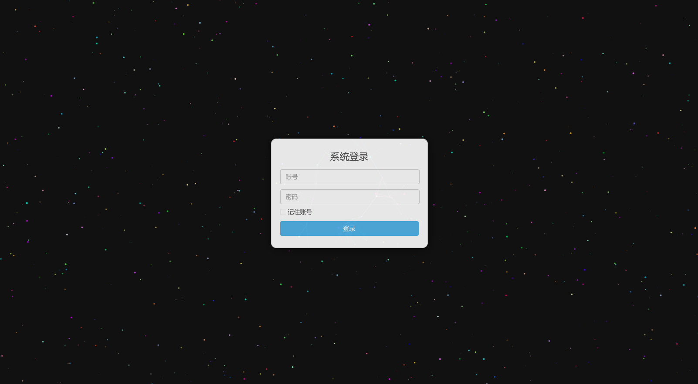
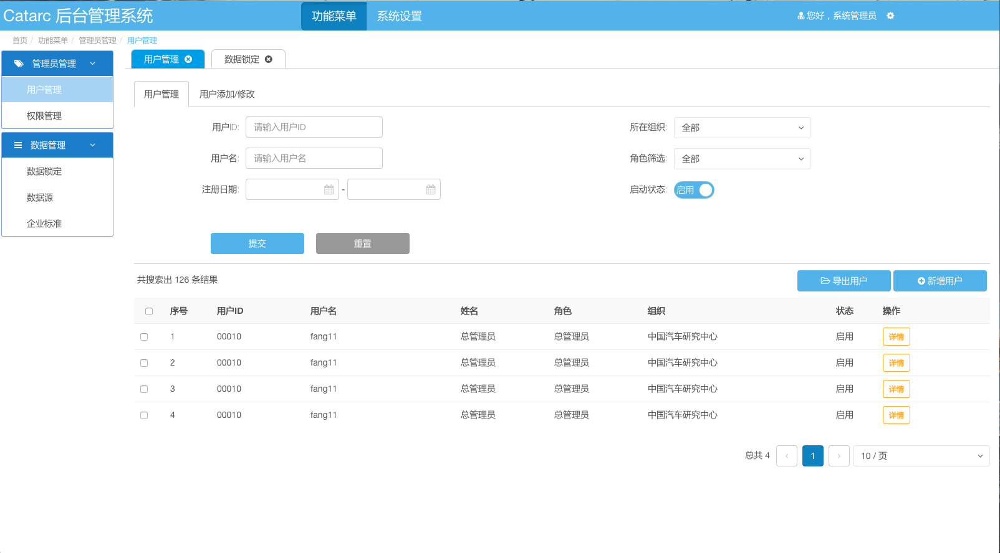
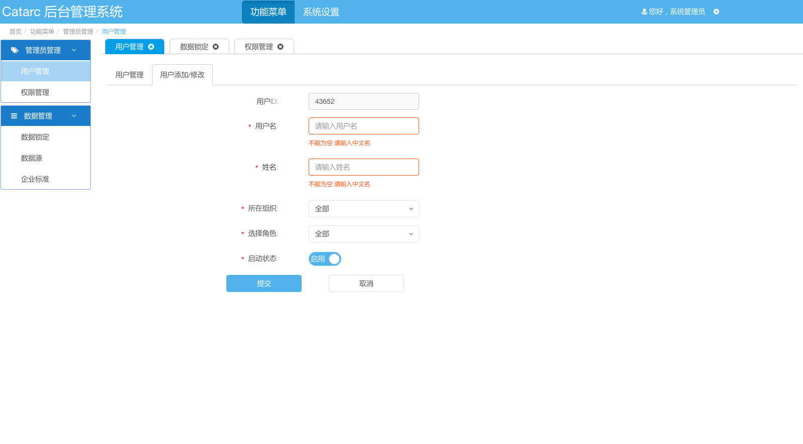
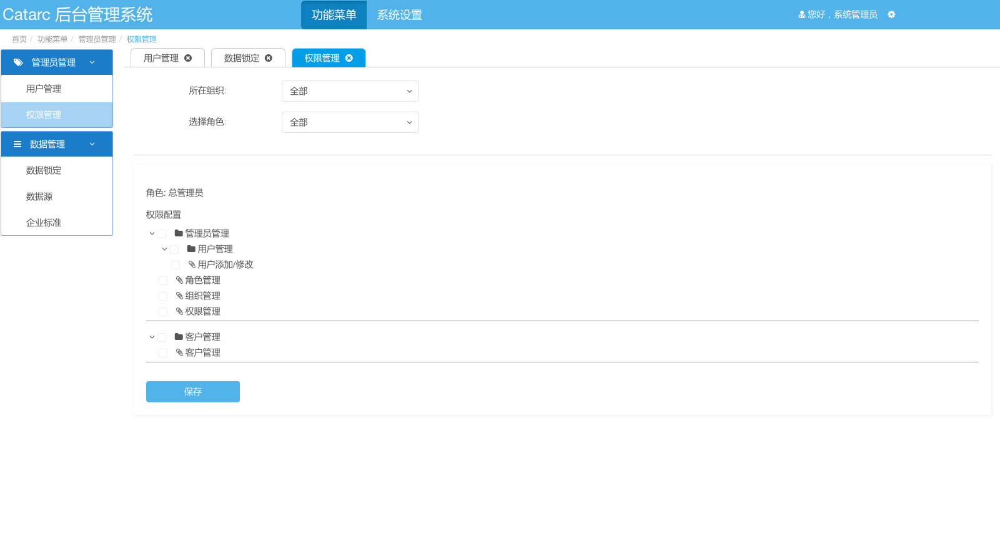
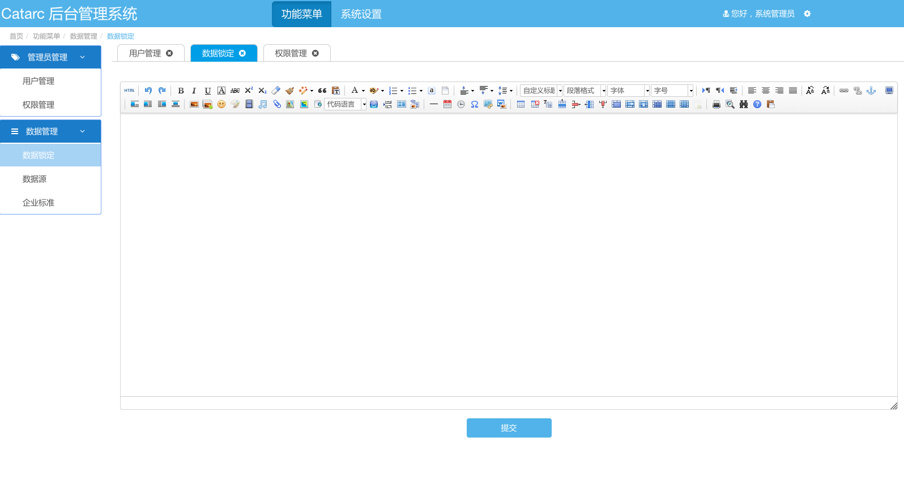
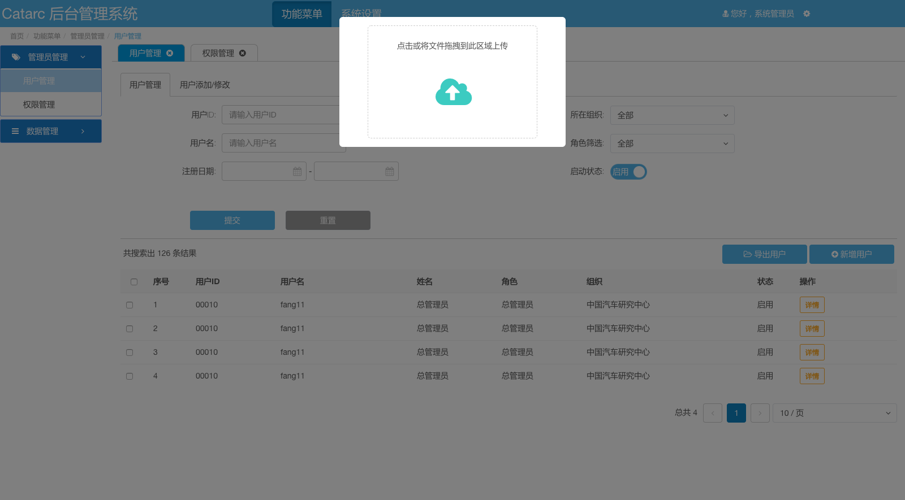
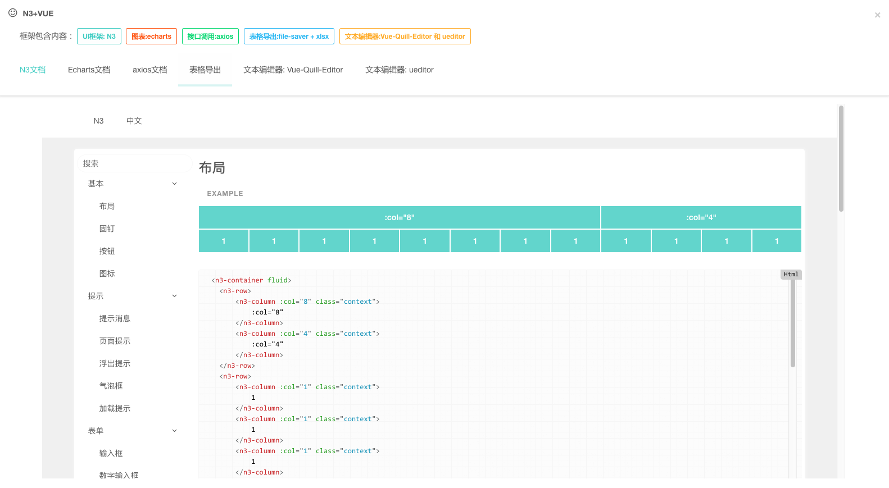

# 简述
本项目是一个后台管理框架，适用于初学者或是有其他框架经验的同学来借鉴，该项目的重点为路由的多层嵌套，异步路由的使用，以及整合部分三方插件，简单点的封装http请求，目前只有静态的东西，为设计到调用接口，如果有大神看到的不足之处还希望多多包涵，多提宝贵意见。


# 技术栈

vue2 + N3 +vuex + vue-router + webpack + axios + Ueditor + echars + less + vue-quill-editor + (xlsx+file-saver）

# 项目启动

	git clone https://github.com/LightMakise/vue-n3.git

	cd vue-n3

	npm install

	npm run dev

# 目标功能
- [x] 路由的异步加载 -- 完成
- [x] 路由嵌套 -- 完成
- [x] 表格导出 -- 完成
- [x] 使用session登录登出 -- 完成
- [x] axios请求简单的封住 -- 完成
- [x] 表单校验 -- 完成
- [x] 图片上传区域显示 -- 完成
- [x] 路由选项卡切换缓存页面数据 -- 完成
- [ ] 主题切换 -- 编写中

# 项目截图
> 登录页面



> 表格页面



> 表单页面



> 权限管理页面



> 编辑器页面



> 上传文件页面



> 文档页面




# 目录说明
```
├── README.md
├── build 	 						        //webpack配置文件
│   ├── build.js
│   ├── check-versions.js
│   ├── logo.png
│   ├── utils.js
│   ├── vue-loader.conf.js
│   ├── webpack.base.conf.js
│   ├── webpack.dev.conf.js
│   └── webpack.prod.conf.js
├── config							        //项目路径配置
│   ├── dev.env.js
│   ├── index.js
│   └── prod.env.js
├── dist							        //上线文件，可访问
│   ├── index.html
│   └── static
├── index.html							        //项目入口html文件
├── package-lock.json
├── package.json
├── postcss.config.js
├── src								        //源码文件
│   ├── App.vue							        //页面入口文件
│   ├── assets							        //资源文件夹
│   │   ├── css							        //样式表文件夹
│   │   │   ├── global.css					        //全局样式
│   │   │   ├── theme						        //部分主题样式
│   │   │   │   └── theme.css 		                                //当前主题样式
│   │   ├── images					                //图片文件夹
│   │   └── logo.png
│   ├── components					                //组件
│   │   ├── demo					                //后台管理项目组件
│   │   │   ├── Home.vue			                        //首页
│   │   │   ├── Login.vue			                        //登录页面
│   │   │   ├── functional			                        //功能菜单主页
│   │   │   ├── layout				                        //布局
│   │   │   └── system				                        //系统设置主页
│   │   ├── doc						                //文档页面
│   │   │   ├── Axios.vue
│   │   │   ├── Echarts.vue
│   │   │   ├── Editor.vue
│   │   │   ├── ExportTable.vue
│   │   │   ├── Home.vue
│   │   │   ├── Index.vue
│   │   │   └── Ueditor.vue
│   │   └── module					                //公用的组件
│   │       └── Navbar.vue			                        //选项卡
│   ├── http						                //HTTP封装
│   │   ├── api.js					                //api调用封装
│   │   └── http.js					                //axiox封装
│   ├── main.js						                //程序入口文件，加载各种公共组件
│   ├── nav							        //导航数据
│   │   └── index.js				                        //导航数据主文件
│   ├── router						                //路由
│   │   └── index.js				                        //路由主文件
│   └── store						                //状态管理器
│       └── index.js				                        //状态管理器主文件
└── static							        //静态资源文件夹，存放第三方类库
    └── UE							        //Ueidtor源文件

```

# 备注

> 本项目如果对您有帮助,请您star，您的star就是我的动力

> 该项目部分页面借鉴了一位大神的作品 [点击此处看大神的项目](https://github.com/N3-components/N3-admin) 